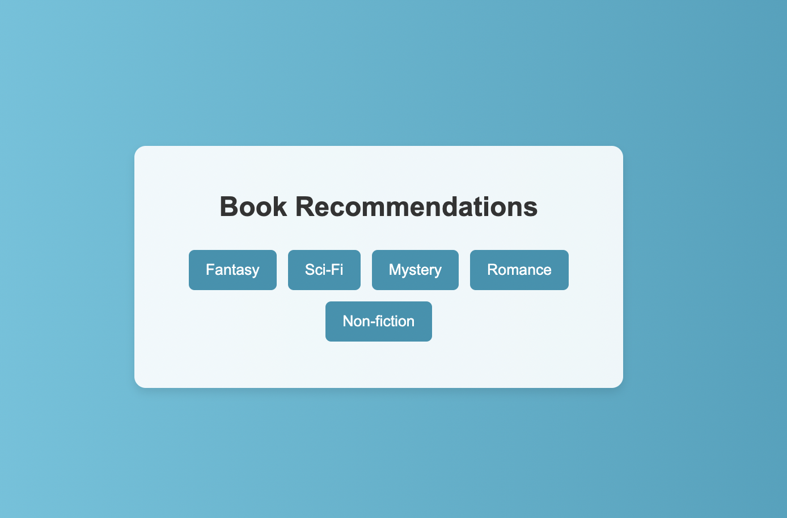
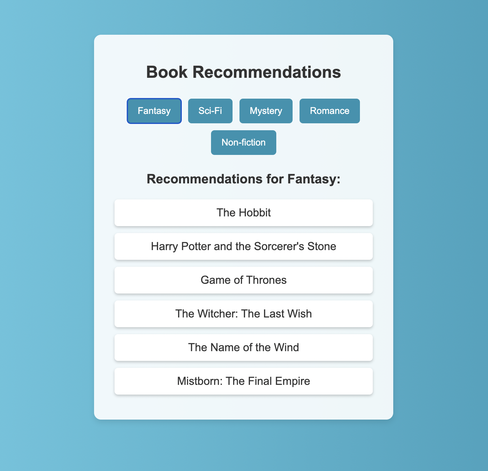
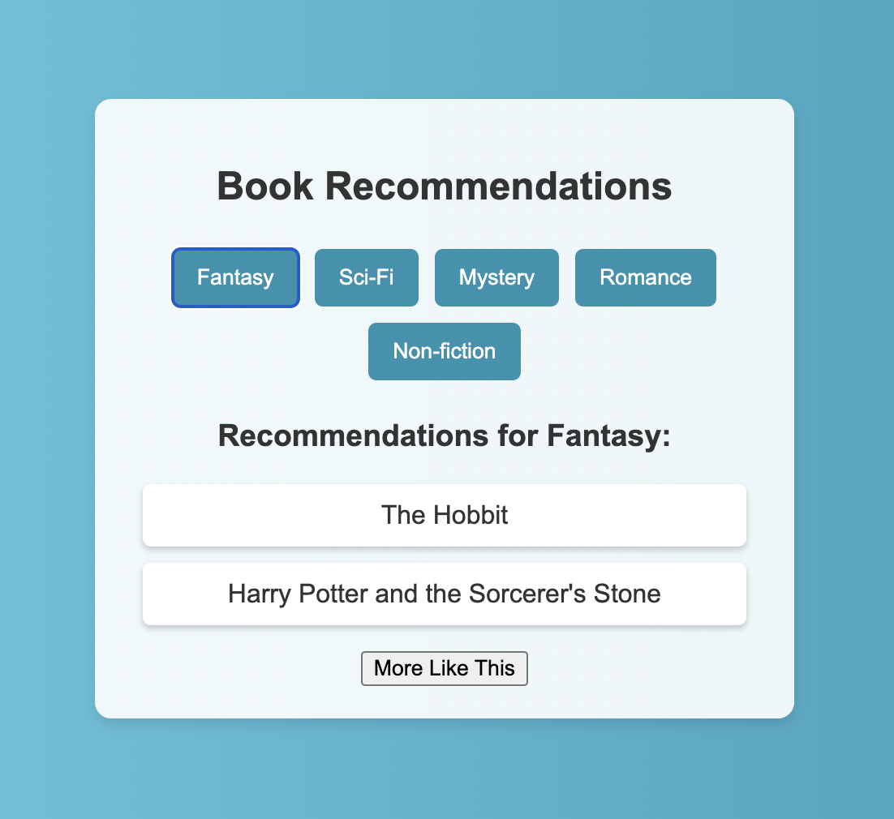
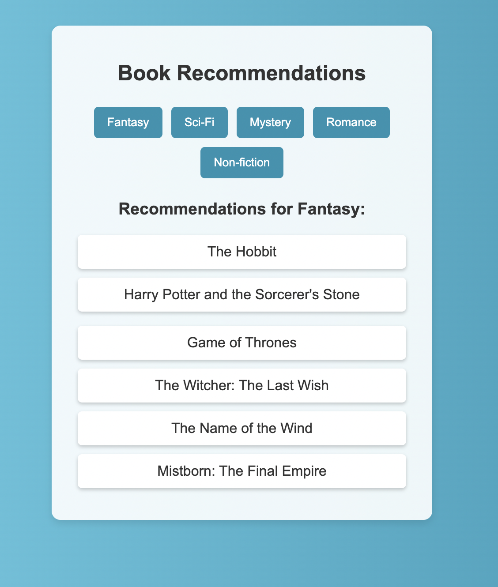

# Book Recommendations Project Instructions


## Objective

Create a React application that allows users to select a book genre and view a list of books in that genre. Your main tasks are to implement the genre selection buttons and display the list of books for the selected genre.

## Setup

- `fork` and `clone` this repo

- `cd` into the repo and run `npm install`

Your project setup includes a `BookRecommendations` component and a `books.json` file containing an object of book titles for each genre.

**`books.json` Example:**

```json
{
  "Fantasy": [
    "The Hobbit",
    "Harry Potter",
    "Game of Thrones",
    "The Witcher",
    "The Name of the Wind",
    "Mistborn"
  ],
  "Sci-Fi": [
    "Dune",
    "Ender's Game",
    "The Martian",
    "Foundation",
    "Neuromancer",
    "Snow Crash"
  ]
  // ... other genres
}
```

## Core Tasks

1. **State Setup**:

   - You will be working in the `BookRecommendations` component
   - The book data has been imported from `books.json`.
   - The `BookRecommendations` component has been set up to hold and manage the json list of book recommendations.
   - The CSS has already been created. Do not change the classNames that are associated with the `<div>`s in the `BookRecommendations.jsx` file

2. **Create Genre Buttons**:

   - Map over the genres in your book data to create a button for each genre.
   - Add an `onClick` event to each button that updates the state with the selected genre and corresponding book recommendations.

   _\*\*HINT: You may want to add a slice of state as well as a function to help implement this functionality._

3. **Display Book Recommendations**:

   - Include and `<h2>` tag which says 'Recommendations for `<the recommendation genre>`.
   - The genre in the `<h2>` should change dynamically.
   - Display the list of books for the currently selected genre.
   - Ensure this list updates correctly when a new genre is selected.

   _\*\*HINT:You may want to add a slice of state to help implement this functionality_

## Bonus Challenge

### Easier Option

- **Nest child components in `BookRecommendations` components**

  - separate the button list `div` and the recommendations `div` into two components `RecommendationButtons.jsx` and `RecommendationList.jsx`
  - pass the components the correct props so that they function the same way

### More Challenging Option

- **Implement a "More Like This" Feature**:
  - Initially, show only the first two books of the selected genre.
  - Add a "More Like This" button that, when clicked, displays the rest of the books in that genre.

## Tips

- **Images**: Reference the images below for the look of your app.
- **State Management**: Think about how to structure your state to manage both the selected genre and the list of recommendations effectively.
- **Event Handling**: Consider creating separate functions for handling genre selection and the "More Like This" feature. This helps keep your code organized and maintainable.
- **Key Props in Lists**: Remember to use key props when mapping over arrays in React to prevent rendering issues. The key should be a unique identifier for each element in the array.
- **Conditional Rendering**: Use conditional rendering to display the "More Like This" button and the additional book recommendations based on the state.

## Core Tasks Images:

### Landing Page:



### Genre Button Clicked:



## More Like This Bonus Images

## Genre Button Clicked:



## More Like This Button Clicked


